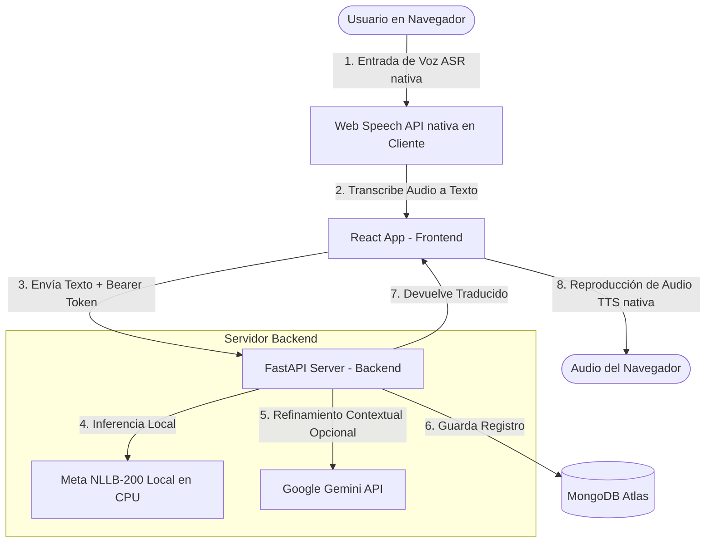

# RunaTranslate — Detalles Técnicos y Arquitectura del Proyecto

---

## Índice

* [1. Problemática y Justificación](#1-problemática-y-justificación)
* [2. Objetivos del Proyecto](#2-objetivos-del-proyecto)
* [3. Arquitectura Tecnológica Detallada](#3-arquitectura-tecnológica-detallada)
* [4. Cerebro de IA y Procesamiento Distribuido (Arquitectura Asimétrica)](#4-cerebro-de-ia-y-procesamiento-distribuido-arquitectura-asimétrica)
* [5. Estructura del Proyecto (Monorepo)](#5-estructura-del-proyecto-monorepo)
* [6. Seguridad y Base de Datos (Firebase Híbrido y MongoDB)](#6-seguridad-y-base-de-datos-firebase-híbrido-y-mongodb)
* [7. Recomendaciones y Mejoras Futuras](#7-recomendaciones-y-mejoras-futuras)

---

## 1. Problemática y Justificación

*   **Pérdida Cultural:** El Quechua y el Aimara son patrimonios lingüísticos que sufren una pérdida constante de hablantes activos en entornos urbanos y digitales.
*   **Inaccesibilidad de Herramientas:** Las plataformas comerciales carecen de un soporte preciso para lenguas andinas o imponen costos de API inaccesibles.
*   **Propuesta de Valor:** RunaTranslate ofrece traducción de texto y voz interactiva en una plataforma web responsiva, optimizada para funcionar en zonas con conectividad limitada gracias a su motor híbrido local/nube.

---

## 2. Objetivos del Proyecto

### A. Objetivo General
Desarrollar una aplicación inteligente utilizando Inteligencia Artificial para traducir lenguas regionales y mejorar la inclusión digital, lingüística y cultural.

### B. Objetivos Específicos
1.  **Diseñar e implementar** una plataforma de traducción automática de texto y voz adaptable a dispositivos móviles.
2.  **Integrar algoritmos locales de IA** para el procesamiento de lenguaje natural (NLP) reduciendo la latencia y la dependencia de APIs externas.
3.  **Implementar un Módulo Inteligente** de corrección contextual para pulir la precisión semántica de los dialectos regionales.
4.  **Habilitar un Módulo Administrativo** para registrar métricas de uso y facilitar la toma de decisiones de preservación cultural.
5.  **Evaluar la precisión** y robustez de los motores de traducción del sistema en el entorno local.

---

## 3. Arquitectura Tecnológica Detallada

El proyecto RunaTranslate adopta una arquitectura de software modular, desacoplada y basada en servicios independientes dentro de un único repositorio (Monorepo), lo que facilita el desarrollo concurrente y simplifica el despliegue:

### A. Frontend (Capa de Presentación)
*   **Framework Principal:** **React (v18)** utilizando **TypeScript** para un tipado estático estricto, mejorando la robustez y auto-documentación del código del cliente.
*   **Compilador y Empaquetador:** **Vite**, que optimiza drásticamente los tiempos de compilación mediante recarga en caliente (HMR) y empaqueta recursos ultraligeros para producción.
*   **Diseño Visual:** Estilo responsivo desarrollado con Tailwind CSS. Se adoptó una interfaz premium de estética Obsidian/Teal con animaciones suaves, micro-transiciones al hacer hover en botones, y adaptabilidad total para pantallas táctiles de dispositivos móviles.
*   **Estado Global:** **React Context API** y Hooks personalizados (`useAuth`) para manejar y propagar reactivamente los datos de sesión, tokens de acceso y estados de carga (`loading`).

### B. Backend (Capa de Lógica y API)
*   **Framework API:** **FastAPI (Python)**, que destaca por su velocidad excepcional (gracias a su soporte asíncrono con ASGI `uvicorn`) y por la validación de payloads basada en esquemas estructurados de **Pydantic (v2)**.
*   **Seguridad CORS:** Middleware configurado de forma estricta para bloquear peticiones no autorizadas y permitir el acceso de dominios específicos en producción.
*   **Documentación Interactiva:** Exposición automática de especificaciones OpenAPI y consolas de pruebas visuales como **Swagger UI** (`/api/v1/docs`) y **ReDoc** (`/api/v1/redoc`).

### C. Base de Datos (Capa de Persistencia)
*   **Motor de Base de Datos:** **MongoDB Atlas** (capa en la nube). Se seleccionó una base de datos NoSQL por la flexibilidad de su esquema documental (JSON), ideal para manejar traducciones que varían en estructura o que pueden registrar diferentes dialectos y metadatos contextuales variables.
*   **Colecciones Utilizadas:**
    *   `users`: Mapea perfiles sincronizados (uid, email, name, role).
    *   `translations`: Almacena el historial individual enlazado por `userId`.
    *   `statistics`: Colección agregada que consolida métricas globales de uso agrupadas por fecha.

### D. Autenticación (Capa de Identidad)
*   **Servicio Identity Provider:** **Firebase Auth (Google)**, delegando la seguridad de las contraseñas, el cifrado de datos sensibles de autenticación y la emisión de tokens JWT seguros.
*   **Validación Desacoplada:** El backend de Python valida los tokens JWT en tiempo de ejecución de manera ligera (usando `PyJWT` y `cryptography`) descargando de forma dinámica los certificados públicos HTTPS de Google. Esto elimina la necesidad de almacenar y exponer archivos `.json` de credenciales administrativas en el servidor.

---

## 4. Cerebro de IA y Procesamiento Distribuido (Arquitectura Asimétrica)

La solución implementa una **Arquitectura Asimétrica Client-Server** para optimizar el consumo de la CPU del servidor y asegurar costos de infraestructura de **$0**:



### Detalle de Componentes:
1.  **Traducción Local (Inferencia en CPU):** Utiliza el modelo open-source **Meta NLLB-200** (`facebook/nllb-200-distilled-600M`) cargado directamente en el backend. No consume tokens de APIs de pago para realizar traducciones básicas.
2.  **Corrección Contextual Inteligente (Nube):** Si la clave de Google Gemini está configurada, el backend utiliza la API gratuita de **Gemini 2.5 Flash-lite** para corregir desvíos gramaticales del modelo local, adaptando las oraciones a modismos regionales y culturales nativos.
3.  **Procesamiento de Audio en el Cliente (Voz a Texto ASR y Texto a Voz TTS):** El procesamiento de voz se realiza íntegramente en el hardware del usuario a través de la **Web Speech API** del navegador. El servidor nunca recibe archivos de audio pesados, lo que reduce el tráfico de red al mínimo y garantiza un funcionamiento instantáneo y gratuito.
4.  **Tolerancia a fallos (Resiliencia en zonas rurales):** Si no hay conexión a internet o se pierden las claves, la plataforma **no se bloquea**. Cae de forma segura a traducción local (NLLB-200) y autenticación en simulador local (`mockAuth`).

---

## 5. Estructura del Proyecto (Monorepo)

```text
runa-translate-ai/
├── DETALLES_PROYECTO.md     # Estructura de la arquitectura e innovación para exposición (este archivo)
├── README.md                # Presentación general del proyecto y guía de inicio rápido
├── api/                     # Backend FastAPI (Python)
│   ├── main.py              # Inicializador y rutas de la API
│   ├── core/                # Configuración de base de datos y validación de tokens (auth.py)
│   ├── routers/             # Endpoints (traducción, historial, estadísticas, sincronización)
│   └── requirements.txt     # Librerías de Python (incluye PyTorch, PyJWT, Cryptography)
└── web/                     # Frontend React (TypeScript + Vite)
    ├── src/
    │   ├── context/         # AuthContext.tsx (estado de sesión global)
    │   ├── pages/           # Vistas (TranslationPage, LoginPage, HistoryPage, AdminStatsPage)
    │   └── services/        # Cliente de la API y conector de Firebase
    └── package.json         # Dependencias web (Firebase SDK, Lucide React)
```

---

## 6. Seguridad y Base de Datos (Firebase Híbrido y MongoDB)

Para la protección de datos, la resiliencia en la demostración en vivo y el control de accesos, el sistema implementa tres pilares de seguridad:

### A. Autenticación Híbrida Inteligente
*   **Modo Cloud (Producción):** El frontend utiliza el SDK web oficial de Firebase para interactuar con la nube de Google. Cuando un usuario inicia sesión, Firebase emite un token JWT firmado. El backend (FastAPI) descarga los certificados públicos de Google en tiempo de ejecución, extrae la clave pública RSA correspondiente y valida criptográficamente el token sin requerir archivos de cuentas de servicio complejos en el servidor.
*   **Modo Local (Simulador Offline):** Si las variables de entorno de Firebase no se configuran, la aplicación web automáticamente conmutará al servicio `mockAuth` (localStorage). El simulador genera tokens locales firmados con un formato especial (`mock-<uid>||<email>||<name>`) que el backend reconoce y descifra de forma transparente en desarrollo. Esto **garantiza que la demo en vivo nunca falle ante una desconexión accidental de internet**.

### B. Vinculación y Privacidad de Datos (MongoDB)
*   **Aislamiento del Historial:** Cada traducción enviada por un usuario autenticado se almacena en la base de datos de MongoDB con su correspondiente `userId` (Firebase UID).
*   **Filtros de Consulta:** Al cargar el historial de traducciones (`GET /api/v1/history`), el backend FastAPI extrae el `userId` directamente desde el token JWT decodificado y restringe la consulta en MongoDB para que el usuario solo pueda ver sus datos propios.
*   **Protección de Rutas (Guards):** El frontend implementa componentes guardianes de React que bloquean el acceso al historial a usuarios no autenticados, redirigiéndolos de forma interactiva a la pantalla de Login.

### C. Módulo Administrativo y Control de Roles
*   **Verificación de Roles:** La colección de `users` en MongoDB asigna el rol `"admin"` a usuarios clave (identificados en la fase de registro por correos administrativos).
*   **Estadísticas Globales Protegidas:** El endpoint `/api/v1/admin/stats` realiza agregaciones de uso en MongoDB. Este endpoint verifica el rol decodificado del token JWT y deniega el acceso con un código `403 Forbidden` a cualquier usuario con rol `"user"`, blindando la información de estadísticas de la plataforma.

---

## 7. Recomendaciones y Mejoras Futuras

*   **Entrenamiento Continuo:** Continuar entrenando y ajustando los modelos de IA locales (Meta NLLB-200) con datasets bilingües específicos de variaciones dialectales regionales.
*   **Traducción mediante Cámara (OCR):** Integrar la cámara del dispositivo móvil para traducir textos impresos en carteles o documentos físicos en tiempo real.
*   **Chat Multilenguaje Inteligente:** Implementar salas de chat interactivas grupales donde hablantes de Español, Quechua y Aimara puedan chatear recibiendo traducciones instantáneas adaptadas a su idioma nativo.
*   **Traducción en Videollamadas:** Integrar traducción de voz simultánea y directa en videollamadas.
*   **Expansión Institucional:** Extender el uso del sistema a dependencias del sector público (salud, justicia y educación) para asegurar una atención inclusiva y bilingüe.
